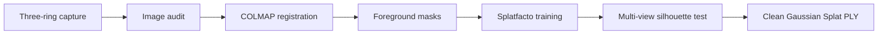

# Close-range object reconstruction with 3D Gaussian Splatting

This project reconstructs a small glossy figurine from a handheld, three-level orbit capture. It tests a practical object-centric workflow built from camera pose recovery, foreground masks, 3D Gaussian Splatting (3DGS), and multi-view cleanup.

The main difficulty is foreground separation. Masked training alone still leaves background Gaussians initialized by structure from motion, while a simple radius crop fails where the figurine, base, table, and background overlap in model space. The final model therefore keeps a Gaussian only when its projections agree with the foreground masks across the registered cameras.

[](https://raccoon663.github.io/close-range-object-reconstruction-3dgs/viewer/)

**[Open the interactive viewer — drag to orbit, scroll to zoom](https://raccoon663.github.io/close-range-object-reconstruction-3dgs/viewer/)**

## Results

| Stage | Result |
|---|---:|
| Source capture | 268 photographs, 7008 × 4672 |
| Structure from motion | 247 / 247 training views registered |
| Sparse reconstruction | 21,035 points |
| 3DGS training | 3504 × 2336, 30,000 iterations |
| Gaussians before silhouette cleanup | 73,653 |
| Gaussians retained at 0.80 support | 19,165 |
| Valid Gaussians in exported PLY | 19,118 |
| Clean model size | 4.52 MB |

The cleaned Gaussian Splat is in [model/dragon_object_half_clean.ply](model/dragon_object_half_clean.ply). A rendered orbit is in [assets/dragon_orbit.mp4](assets/dragon_orbit.mp4).

<p align="center">
  
  
</p>

## Capture

The camera was moved around the stationary figurine in lower, middle, and upper elevation rings. Dense adjacent views were retained because reduced-image experiments fragmented the structure-from-motion model.

| Component | Configuration |
|---|---|
| Camera | Sony ILCE-7CM2 (α7C II) |
| Lens | Tamron 25–200 mm F/2.8–5.6 Di III VXD G2 (A075), Sony E |
| Recorded focal length | 49 mm (193 images), 50 mm (47), 51 mm (28) |
| Aperture | f/8 (230), f/4 (28), f/6.3 (10) |
| Exposure time | 1/80–1/30 s |
| ISO | 2500–12800 |
| Capture pattern | three handheld orbit rings |

Eighteen evenly spaced, metadata-stripped sample frames are included in [sample_data/](sample_data/). Their source filenames and SHA-256 values are recorded in [sample_data/manifest.csv](sample_data/manifest.csv). The complete 268-image capture is 6.14 GB and is kept outside the Git repository.


## Method

1. Audit the 268 photographs and reserve 21 source-level holdout frames.
2. Recover a connected camera model with PyCOLMAP and exhaustive feature matching.
3. Generate foreground silhouettes from box-prompted SAM2 masks.
4. Train Nerfstudio Splatfacto at half resolution with the masks supplied to the data parser.
5. Project Gaussian centers into the registered views and measure foreground support.
6. Retain Gaussians with support of at least 0.80 and export a portable PLY.



The mask review sheet and recovered camera layout provide two checks on the preprocessing stage.

<p align="center">
  
  
</p>

## Reproduction

The repository keeps the scripts used for image registration, mask generation, half-resolution training, and COLMAP visualization. Paths are passed as arguments or resolved relative to the repository.

```powershell
# Structure from motion
python scripts/run_colmap.py `
  --images <path-to-images> `
  --manifest <path-to-training-manifest> `
  --workspace outputs/colmap `
  --matcher exhaustive --fresh

# Foreground masks
python scripts/generate_object_masks.py `
  --images <path-to-images> `
  --manifest <path-to-training-manifest> `
  --output data/masks `
  --output-downscaled data/masks_2 --downscale 2

# 3DGS training
powershell -ExecutionPolicy Bypass -File scripts/train_object_half.ps1
```

The original photographs, model weights, virtual environments, training checkpoints, and background-inclusive baseline export are excluded. See [docs/environment.md](docs/environment.md) and [docs/final_report.md](docs/final_report.md) for the exact run configuration and experiment notes.

## Limitations

The transparent gold accessory and glossy plastic produce view-dependent highlights that do not satisfy a simple Lambertian scene assumption. High ISO, slow shutter speeds, and shallow depth of field also limit source sharpness. Unseen surfaces and mask boundaries can appear soft or contain small floating splats. The exported representation is a Gaussian Splat rather than a watertight polygon mesh.

A stronger capture would use diffuse fixed lighting, a matte neutral background, locked focus and exposure, lower ISO, and deliberate bridge views between elevation rings.

## Software

COLMAP / PyCOLMAP, Nerfstudio Splatfacto, gsplat, SAM2, PyTorch, Pillow, and NumPy.
