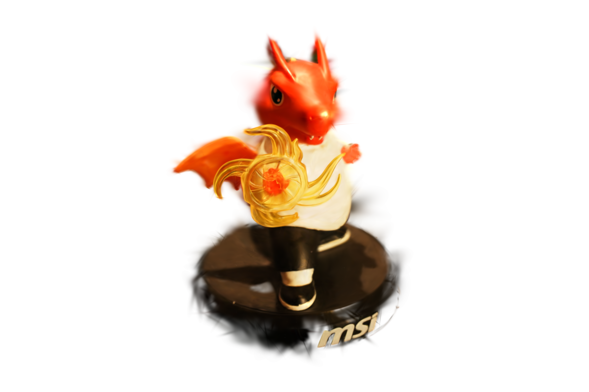
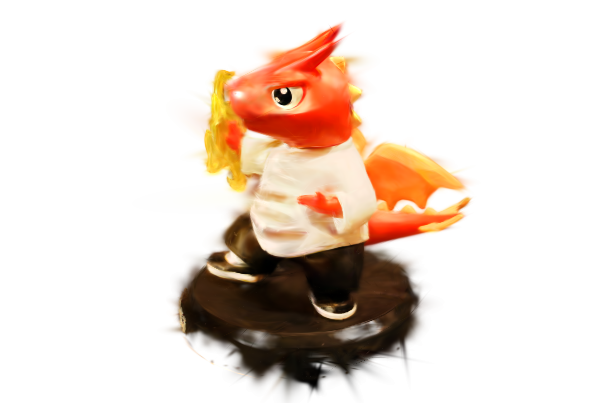
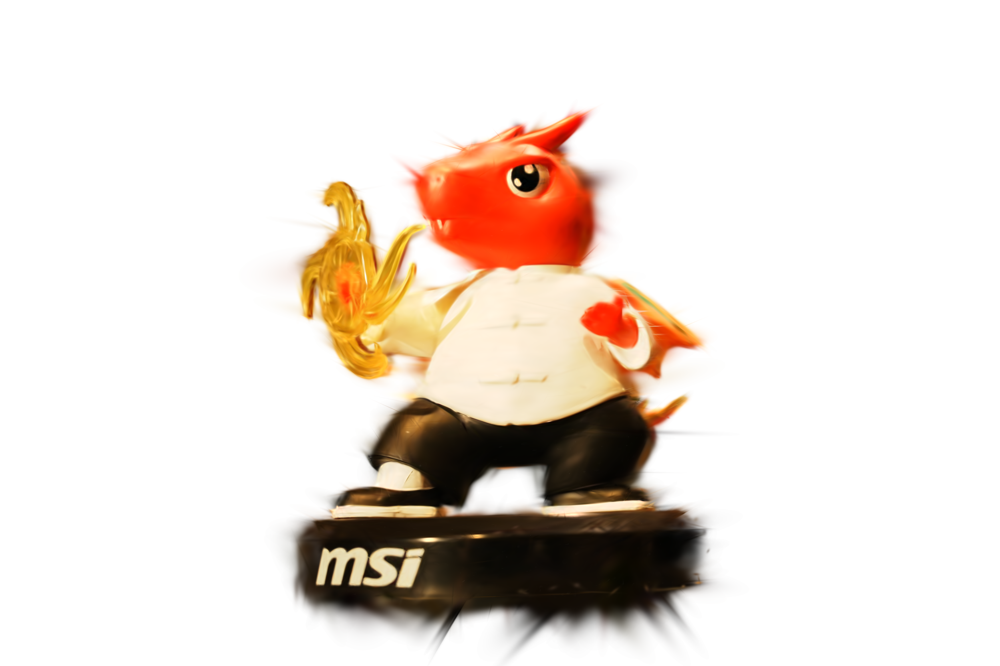
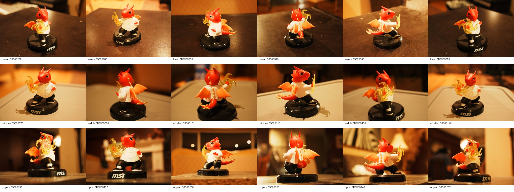
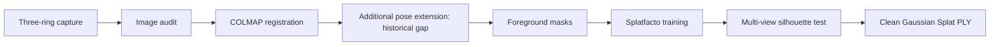
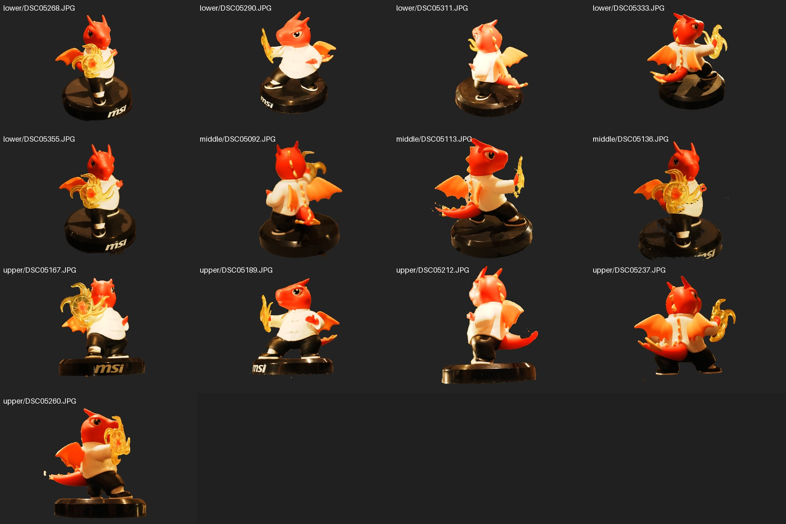
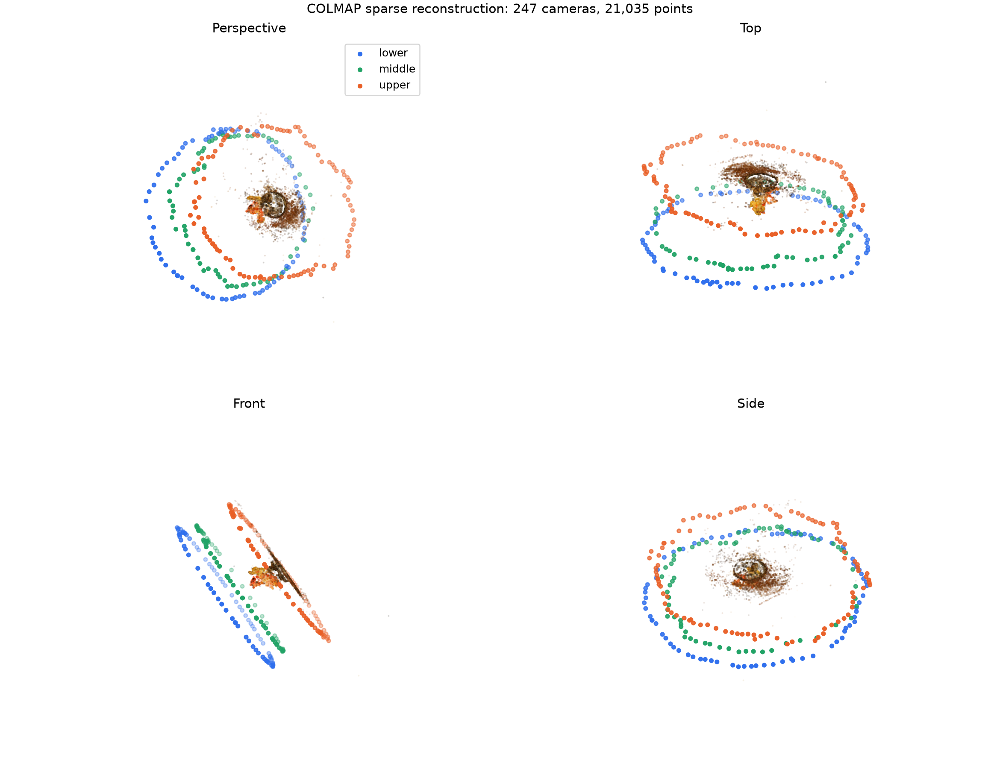

# Close-range object reconstruction with 3D Gaussian Splatting

This project reconstructs a small glossy figurine from a handheld, three-level orbit capture. It tests a practical object-centric workflow built from camera pose recovery, foreground masks, 3D Gaussian Splatting (3DGS), and multi-view cleanup.

The main difficulty is foreground separation. Masked training alone still leaves background Gaussians initialized by structure from motion, while a simple radius crop fails where the figurine, base, table, and background overlap in model space. The final model therefore keeps a Gaussian only when its projections agree with the foreground masks across the registered cameras.

[](https://raccoon663.github.io/close-range-object-reconstruction-3dgs/viewer/)

**[Open the interactive viewer — drag to orbit, scroll to zoom](https://raccoon663.github.io/close-range-object-reconstruction-3dgs/viewer/)**

## Results

| Stage | Result |
|---|---:|
| Source capture | 268 photographs, 7008 × 4672 |
| Final camera model (after additional pose extension) | 247 / 247 source-selected views registered |
| Sparse reconstruction | 21,035 points |
| 3DGS training | 3504 × 2336, 30,000 iterations |
| Gaussians before silhouette cleanup | 73,653 |
| Gaussians retained at 0.80 support | 19,165 |
| Valid Gaussians in exported PLY | 19,118 |
| Clean model size | 4,742,856 bytes (4.52 MiB) |

The cleaned Gaussian Splat is in [model/dragon_object_half_clean.ply](model/dragon_object_half_clean.ply). A rendered orbit is in [assets/dragon_orbit.mp4](assets/dragon_orbit.mp4).

These are historical run results, except the final PLY count/size, which can be
checked directly. The automated 247-image baseline registered 245 images across
four models (largest 150); the final connected model required an additional
“pose extension” stage whose implementation/state is unavailable. The new cleanup
script has not been shown to reproduce the reported intermediate counts.

<p align="center">
  
  
</p>

## Capture

The camera was moved around the stationary figurine in lower, middle, and upper elevation rings. Dense adjacent views were retained because reduced-image experiments fragmented the structure-from-motion model.

| Component | Configuration |
|---|---|
| Camera | Sony ILCE-7CM2 (α7C II) |
| Lens | Tamron 25–200 mm F/2.8–5.6 Di III VXD G2 (A075), Sony E |
| Recorded focal length | 49 mm (193 images), 50 mm (47), 51 mm (28) |
| Aperture | f/8 (230), f/4 (28), f/6.3 (10) |
| Exposure time | 1/80–1/30 s |
| ISO | 2500–12800 |
| Capture pattern | three handheld orbit rings |

Eighteen evenly spaced, metadata-stripped sample frames are included in [sample_data/](sample_data/). Their source filenames and SHA-256 values are recorded in [sample_data/manifest.csv](sample_data/manifest.csv). The complete 268-image capture is 6.14 GB and is kept outside the Git repository.



## Method

1. Audit the 268 photographs and reserve 21 source-level capture frames.
2. Run PyCOLMAP with exhaustive matching; the historical final connected model additionally required an unrecovered pose-extension stage.
3. Generate foreground silhouettes from box-prompted SAM2 masks.
4. Train Nerfstudio Splatfacto at half resolution with the masks supplied to the data parser.
5. Project Gaussian centers into the registered views and measure foreground support.
6. Retain Gaussians with support of at least 0.80 and export a portable PLY.



The mask review sheet and recovered camera layout provide two checks on the preprocessing stage.

<p align="center">
  
  
</p>

## Reproduction

Follow the [complete reproduction workflow](docs/reproduction.md): prepare images
and `train_images.txt` → automated camera recovery → inspect/resolve disconnected
models → SAM2 masks → prepare the Nerfstudio COLMAP layout → train only for a new
experiment → export PLY → cleanup with the recorded coordinate transform → viewer.
`--manifest` remains an alias for `--image-list`; the public sample CSV is metadata,
not a training filename list.

| Component | Reproduction status |
|---|---|
| Published PLY, renders and viewer | Available for direct inspection |
| Automated baseline, masks, visualization | Scripts available; full data and SAM2 weights required |
| Data preparation and cleanup | New implementations with synthetic tests, not recovered historical code |
| Final pose extension | Procedure and intermediate model unavailable |
| Historical training/export | Settings documented; checkpoint, exact lists and parser transform unavailable |

Install lightweight dependencies with `python -m pip install -r requirements.txt`.
The GPU pipeline needs the additional platform-specific setup described in
[docs/environment.md](docs/environment.md). Run synthetic tests with
`python -m pip install pytest` then `python -m pytest -q`.

To inspect the published result, run `python -m http.server 8000` from the root
and open `http://localhost:8000/viewer/`.

## Reconstruction and cleanup

The historical threshold was foreground support ≥ 0.80. The reimplementation adds
`valid_views >= min_valid_views` (default 3, configurable). It explicitly maps
Nerfstudio PLY coordinates back to the COLMAP world frame, applies world-to-camera
poses and lens distortion, and samples the corresponding full-frame masks.
It preserves retained PLY attributes and writes a new diagnostic artifact.
See [coordinate conventions and limitations](docs/cleanup.md).

This is a center-projection silhouette heuristic, not visibility-aware volumetric
segmentation. It does not test Gaussian extent or occlusion; background geometry
can receive false support. Both thresholds and mask quality affect the result.
The published PLY has not been replaced.

## Repository structure

```text
.
├── assets/                 # Renders, mask review, sparse overview, orbit video
├── docs/                   # Capture, environment, provenance and reproduction
├── model/                  # Published Gaussian PLY
├── sample_data/            # 18 reduced images and source-provenance CSV
├── scripts/
│   ├── run_colmap.py
│   ├── generate_object_masks.py
│   ├── prepare_nerfstudio_data.py
│   ├── train_object_half.ps1
│   ├── clean_gaussians_multiview.py
│   └── visualize_colmap.py
├── tests/                  # Synthetic geometry and IO regression tests
└── viewer/                 # Vendored SuperSplat/PlayCanvas viewer
```

## Limitations

Transparent and strongly specular surfaces produce sharp view-dependent effects
that are difficult to represent consistently with finite-order spherical-harmonic
color. 3DGS supports view-dependent appearance; this does not fully solve
transparency or specular reconstruction. High ISO, slow shutter speeds, and shallow
depth of field also limit source sharpness. Unseen surfaces and mask boundaries
can appear soft or contain small floating splats. The result has no metric scale,
is not a watertight mesh, and has no geometric ground truth.

The 21 reserved capture frames have no recovered poses and were not used for
independent novel-view metrics. Nerfstudio's every-14th-image evaluation is a
separate split within the 247 posed images. No PSNR, SSIM, LPIPS or geometric
accuracy is reported. Exact historical reproduction remains limited by the
private originals and missing intermediate state; see the [audit](docs/audit.md).

A stronger capture would use diffuse fixed lighting, a matte neutral background, locked focus and exposure, lower ISO, and deliberate bridge views between elevation rings.

## Software

COLMAP / PyCOLMAP, Nerfstudio Splatfacto, gsplat, SAM2, PyTorch, Pillow, and NumPy.

The interactive engine is the vendored SuperSplat / PlayCanvas viewer, not an
engine authored for this project. Its [MIT license](viewer/SUPERSPLAT_LICENSE.txt)
is retained; [viewer provenance](viewer/README.md) identifies the bundled assets.
The project contribution is reconstruction, foreground isolation, cleanup and
deployment. See the project [license](LICENSE) and [model card](MODEL_CARD.md).
